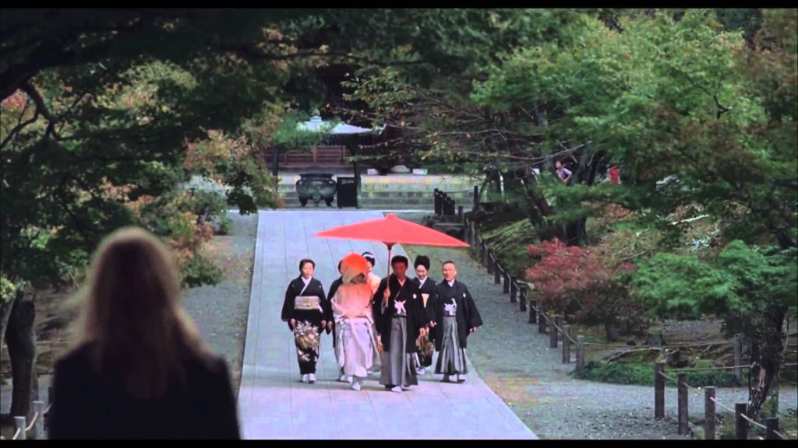

# Insert images
```html
<!-- simple -->

<!-- with caption -->
<figure align="center">

<figcaption align="center">This is my caption text.</figcaption>
</figure>
<!-- The ALT text adds a text description to an image on a Web page -->
```
<figure align="center">

<figcaption align="center">This is my caption text.</figcaption>
</figure>
# Table
```
<!-- with  bullet points -->
| Course |  Comments                       |  
|:-------| :---------------------------    | 
|...     |<ul><li> ...</li><li>...</li><ul>| 
```

| Fruit   | Price  | Advantages                        |  
| ------- | ------ | --------------------------------- |  
| Bananas | $1.34  | {::nomarkdown}<ul><li>built-in wrapper</li><li>bright color</li></ul>{:/} |  
| Oranges | $2.10  | {::nomarkdown}<ul><li>cures scurvy</li><li>tasty</li></ul>{:/} |  