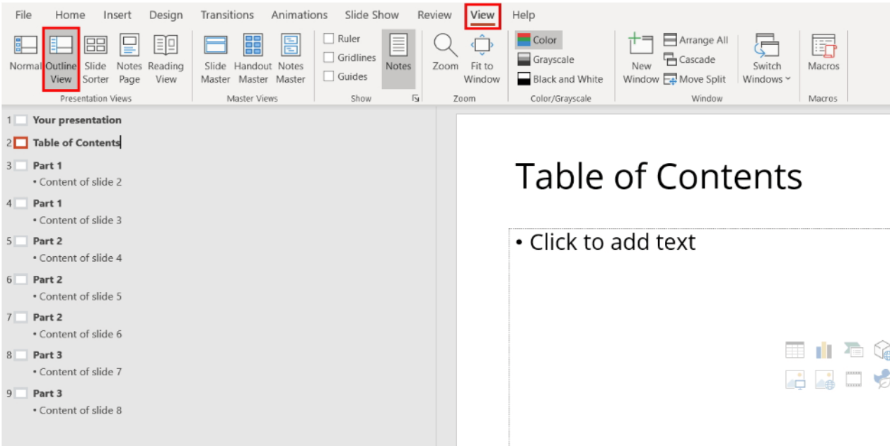

\#apps

# window10/11

| key |  use                       |  
|:-------| :--------------------------| 
|``ctrl + shift + left/right arrow`` | select left/right whole word(s)|
|``window + shift + s`` | screen shot|


Click the middle the cursor to open a new tab for the new page, rather than replace the current with the new.
- disable shift key chaneg language [ref](https://answers.microsoft.com/en-us/windows/forum/all/how-to-disable-shift-key-that-toggles-between/a76cb0aa-329f-4c7d-b12c-96aee6f65065)
  
# Chrome

| key |  use                       |  
|:-------| :--------------------------| 
|``ctrl + shift + c`` | inspect source html|
|``ctrl + shift + v`` | paste with no format|
|``shift + esc``| task manager|
- Group tabs by right click and group.
- Reduce Ram usage by make extension works only when on click.


# vscode

| key |  use                       |  
|:-------| :--------------------------| 
|``ctrl + d`` | select next word matched with current highlight, press ``ctrl + f`` & ``enable`` stuffs like case sensitive to select better match case|
|``ctrl + shift + l`` | select all words matched with current highlight|
|``alt + right click`` | select multiple different words|
|``ctrl+shift+p`` + type``transform``| convert to title case, all uppercase, etc|
|``shift + alt + i``| insert cusor to all select lines|
|``Ctrl + (K => 0)``| Collapse all sections (e.g. markdown heading) within a file|
|``Ctrl + (K => J)``|unfolds all|

- outline on the left sidebar for markdown / .ipynb, convenient & help find which heading to collapse.

in the left sidebar, can collapse all to see only functions of the code file in outline

[remove indentation guides -vertical lines](https://stackoverflow.com/questions/49255934/how-can-i-hide-indent-guides-in-visual-studio-code#:~:text=Click%20on%20menu%20File%20%E2%86%92%20Preferences%20%E2%86%92%20Settings.&text=Untick%20the%20box%20which%20says,This%20removes%20the%20indent%20guides.)

- double click a tab to fix it i.e. not be replaced by next opened tab

- convert all indentation spaces (4)

## Extension

**Markdown paste**  
paste img fastttt. If use for jupyter cell, then type ``ctrl + shift + p`` and then type: ``markdown paste`` to make it work.

# Onenote

| key |  use                       |  
|:-------| :--------------------------| 
|``ctrl + alt + + `` | expand left sidebar|
|``alt + + -`` | collapse sidebar|

# Word Docs

| key |  use                       |  
|:-------| :--------------------------| 
|``right click + m + enter `` | paste with merge format|
| ``alt + = then ctrl + =``| convert text to latex style|

| Custom key | use|  
|:-------| :--| 
|``ctrl + alt + q``| bold, underline, italic|
|``ctrl + alt + 1/2/3``| heading1/2/3...|

**Spacing**  
To remove a spacing in TOC, select the empty line that is formatted as a **heading** to **normal**.  
backspace vs delete: backspace could merge the format of the current section to the closer section. Delete will not. E.g. backspace a paragraph up may merge this p to the format of the upper section e.g. a heading1.

**New row to table**
put cusor at the end (outside the last row of the table), then press ``enter``.

**Customerised**

- To assgin new style via hotkey, **remove** the existing style first
- make sure the title has space line between the previous and next sentence.
- Three level indentation is max as more will lead to complexity in finding info in toc.

change orientation of one page only: Select the text to be in landscape mode, click layout > orientation pop up new window >
selet landscape & selected page instead of the whole document option.

Option > advanced > Paste: merge format from other program

> view > window > open new window: this open the same word doc twice.


**insert checkbox**

Disable compatibility mode & add developer tab.

**custom heading**

font: new times romen
option>paragraph>spacing: single
spacing: reduce to the min

**Proof language disable for US**
Select the “Review” tab, then click on “Language -> Set Proofing Language.” Place a checkmark in the box next to “Do not check for spelling or grammar,” then click “OK.”

**repeat formatting to multiple images**

1. do format to one image
2. press f4 to other image to repeat the same process

# PPT

TOC View 

[ref](https://www.ionos.com/digitalguide/online-marketing/online-sales/table-of-contents-in-powerpoint/)

outline view - see onl heading for each slide
view > outline view > right click > collaspe all

view > master view > changes made here apply to all

# Colab

| key |  use                       |  
|:-------| :--------------------------| 
|``ctrl + m + m`` | convert code to markdown cell|
|``ctrl + m + y`` | convert markdown to code cell|

Kaggle notebook also do.

For larger dataset, upload files as zip to google cloud and then load it in the environment and unzip it there.
> :gem: **Notes**: It would be slow if reference the files directly to google cloud - load in environment before training faster.

# Jupyter notebook

## Notebook cell multiple outputs
```py
# from: https://stackoverflow.com/questions/34398054/ipython-notebook-cell-multiple-outputs, the comment of the second solution, that comment works perfectly on vscode .ipynb, the original one
from IPython.core.interactiveshell import InteractiveShell
get_ipython().ast_node_interactivity = 'all'
```
## Remove plot indicator text in cell output
E.g. ``<AxesSubplot:>``
```py
# add ; at the end of the line  
```

# Nividia, CUDA

cuda:
- cuda not available [redf](https://stackoverflow.com/questions/60987997/why-torch-cuda-is-available-returns-false-even-after-installing-pytorch-with)
- [official install guide](https://docs.nvidia.com/cuda/cuda-installation-guide-microsoft-windows/index.html#abstract)
- [list of history cuda](https://developer.nvidia.com/cuda-toolkit-archive)
- why visual studio needed for cuda toolkit: c++ compiler [ref](https://www.quora.com/What-parts-of-Visual-Studio-are-required-for-the-CUDA-toolkit) [ref2](https://forums.developer.nvidia.com/t/visual-studio-2019-minimal-components-needed-for-cuda-10-installation/81899)
- tutorial of installing cuda toolkit window [ref](https://www.youtube.com/watch?v=hHWkvEcDBO0&ab_channel=AladdinPersson)
- [window visual studio release notes](https://docs.microsoft.com/en-us/visualstudio/releases/2022/release-notes)
- [visual studio not suppported issue](https://forums.developer.nvidia.com/t/no-supported-version-of-visual-studio-was-found-some-components-of-cuda-toolkit-will-not-work-properly-please-install-visual-studio-first-to-get-the-full-functionality/52940)

For whatever reason, thou it is listed on Nvidia offical web that vsiual studio 2022 works, but in my attempt, it fails, and i just use 2019 one instead. [link](https://docs.microsoft.com/en-us/visualstudio/releases/2019/release-notes)

\#nice Finally get cuda working. \# solve long file name issue in window

steps:
- visual studio 2019 not 2022 (prereq based on [nividia official install guide](https://docs.nvidia.com/cuda/cuda-installation-guide-microsoft-windows/index.html#abstract))
- ``nvidia-smi`` command or the control panel to check cuda version
- install cuda toolkit accordingly from: [link](https://developer.nvidia.com/cuda-toolkit-archive)
- install pytorch cuda toolkit from [pytorch getting started](https://pytorch.org/get-started/locally/) notes: use pip over conda if in china - faster
- enable long file name for window if meets OSError due to this file: ......\sals_op_test.test_collect_and_dist.zip [link](https://www.itprotoday.com/windows-10/enable-long-file-name-support-windows-10)
  - Start the registry editor, ``window + r`` then type: regedit.exe
  - Navigate to HKEY_LOCAL_MACHINE\SYSTEM\CurrentControlSet\Control\FileSystem
  - Double click LongPathsEnabled
  - Set to 1 and click OK
  - above seems to still presist based on [here](https://github.com/pytorch/pytorch/issues/23823)
- Done getting started
- cuddn for acceleration
  - create nvidia account
  - register membership
  - download based on cuda version, see archive page if not listed.
  - detailed youtube video on [Installing Latest TensorFlow version with CUDA, cudNN and GPU support - Step by step tutorial 2021](https://www.youtube.com/watch?v=hHWkvEcDBO0)

# Adobe

## pdf reader pro

| key |  use                       |  
|:-------| :--------------------------| 
|``ctrl + e`` | property bar for highlighting|

**create manual TOC using bookmark**

copy the text and add to bookmark section ``ctrl+b``


# Nvidia Geforce

| key |  use                       |  
|:-------| :--------------------------| 
|``alt + z`` | screen record stuffs|

# Others

## Icon

[Folder icon - icon8](https://icon-icons.com/)

## Git

\#git

- [size o-f repo folder](https://stackoverflow.com/questions/8185276/find-size-of-git-repository)
- [remove remote git repo and keep local](https://stackoverflow.com/questions/6313126/how-to-remove-a-directory-from-git-repository)

**gitignore**

``foldername/`` is different from ``/foldername`` where the former one will ignore all folder with such name regardsless to the relative position. The later ignore relative to current root folder, if subfolder has such name, it will not ignore.

# Google doc

Page less format

# Putty

Save session and load: font set to 14 from 10.

