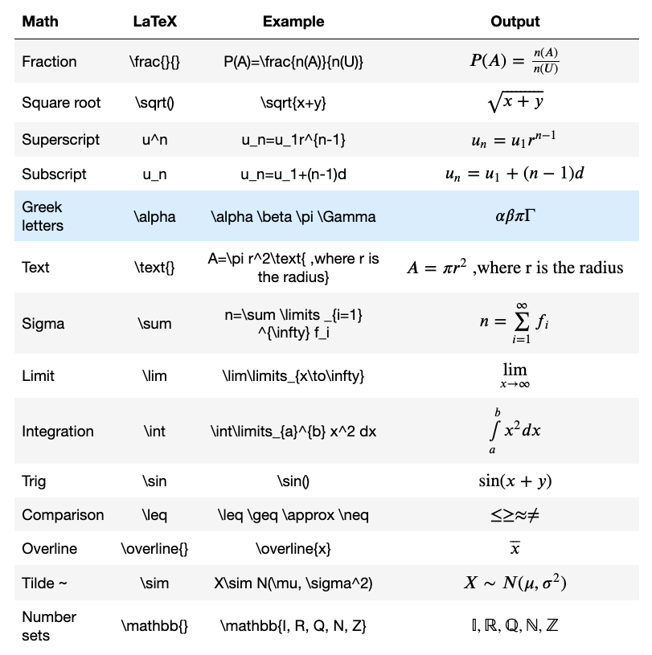

| Math |  Latex |  Output |
|:---| :---|:---|
|Fraction | \frac {a}{b}| $$ \frac {a}{b} $$|
|Superscript| u^n | $$u^n$$|
|Subscript| u_n | $$ u_n $$|
|Greek letters| \alpha \beta \pi \Gamma| $$ \alpha $$|
|Text| \text | $$ 123 \text { ,where ...} $$|
|Sum| \sum | n=\sum|
|Sin| \sin | $$ \sin(x) $$|

# References

- https://stackoverflow.com/questions/13208286/how-to-write-latex-in-ipython-notebook
