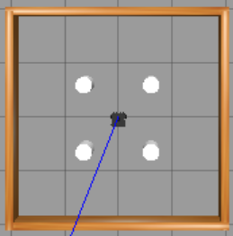
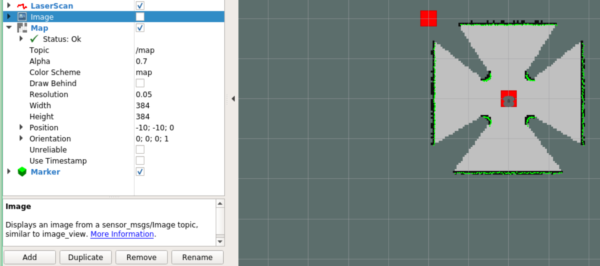

# Setup
> :smile: **Tips**: Every ROS node needs to be run in separate terminal and for each below command, pls open a new terminal.

> :gem: **Note**: Below assume relevant Turtlebot3 packages are installed. I.e. turtlebot3_gazebo turtlebot3 turtlebot3_msgs (this depends)  

As always whenever open a new terminal in ROS1 do:
```bash
source devel/setup.bash
```
Same Gazebo Environment is used for below examples which is:  

```bash 
roslaunch turtlebot3_gazebo turtlebot3_stage_2.launch
```


```bash
roslaunch turtlebot3_slam turtlebot3_slam.launch
# have a look at this launch file, it launchs gmapping & rivz
```

# Troubleshoot
If terminal shows:  ``ModuleNotFoundError: No module named 'rospkg'`` Try:
```bash
# https://answers.ros.org/question/245967/importerror-no-module-named-rospkg-python3-solved/
sudo apt-get install python3-catkin-pkg-modules
sudo apt-get install python3-rospkg-modules
```
> :warning: **DO NOT use this command**: sudo apt-get install python3-catkin-pkg

> :point_right: **Sides**: Below example use turtlebot3 as it has rich community support. Have a look at all launch file with a prefix of turtlebot3_ if time. The code applies to all robot as the topic is how different sensors are communicated.

# Marker

<details>
<summary markdown="span" style="color:blue;">Code</summary>




import rospy
from visualization_msgs.msg import Marker
from geometry_msgs.msg import Point


def print_points(points_list):
    """
    https://answers.ros.org/question/220943/publishing-marker-points-python/
    """
    pub = rospy.Publisher('visualization_marker', Marker, queue_size=1)
    rospy.loginfo('Publishing example line')
    
    rate = rospy.Rate(5)

    iterations = 0
    while not rospy.is_shutdown() and iterations <= 10:
        marker = Marker()
        marker.header.frame_id = "/map"

        marker.type = marker.POINTS
        marker.action = marker.ADD
        marker.pose.orientation.w = 1

        marker.points = points_list
        t = rospy.Duration()
        marker.lifetime = t
        marker.scale.x = 0.4
        marker.scale.y = 0.4
        marker.scale.z = 0.4
        marker.color.a = 1.0
        marker.color.r = 1.0

        pub.publish(marker)
        iterations += 1
        rate.sleep()

def print_line(points_list, rgb=(0,0,255), mid=0):
    
    pub_line_min_dist = rospy.Publisher('visualization_marker', Marker, queue_size=1)
    rospy.loginfo('Publishing example line')
    iteration = 0
    
    while not rospy.is_shutdown():
        if iteration >= 3:
            break
        marker = Marker()
        marker.id = mid
        marker.header.frame_id = "/map"
        marker.type = marker.LINE_STRIP
        marker.action = marker.ADD

        # marker scale
        marker.scale.x = 0.03
        marker.scale.y = 0.03
        marker.scale.z = 0.03

        # marker color
        marker.color.a = 1.0
        marker.color.r = rgb[0]
        marker.color.g = rgb[1]
        marker.color.b = rgb[2]

        # marker orientaiton
        marker.pose.orientation.x = 0.0
        marker.pose.orientation.y = 0.0
        marker.pose.orientation.z = 0.0
        marker.pose.orientation.w = 1.0

        # marker position
        marker.pose.position.x = 0.0
        marker.pose.position.y = 0.0
        marker.pose.position.z = 0.0
        t = rospy.Duration()
        marker.lifetime = t
        # marker line points
        marker.points = points_list
        
        # Publish the Marker
        pub_line_min_dist.publish(marker)
        iteration += 1
        rospy.sleep(0.5)
        
if __name__ == "__main__":
    rospy.init_node('marker_example')
    tmp = []
    # first point
    first_line_point = Point()
    first_line_point.x = 0.0
    first_line_point.y = 0.0
    first_line_point.z = 0.0
    tmp.append(first_line_point)
    # second point
    second_line_point = Point()
    second_line_point.x = 1.0
    second_line_point.y = 1.0
    second_line_point.z = 0.0
    # second point
    thrid = Point()
    thrid.x = 2.0
    thrid.y = 2.0
    thrid.z = 0.0
    tmp.append(thrid)
    
    print_points(tmp)
    # print_line(tmp)


</details>   

```bash
python3 marker.py
```
To see the marker published on Rviz, **Add marker topic** to Rviz by click the add button (see below). 
> :eyes: **Note**: U can save this rviz config file: File -> save config as, and then later run it by include it in the rviz command


To change marker type to e.g. line instead of point, see [Different marker datatype official docs](http://docs.ros.org/en/api/visualization_msgs/html/msg/Marker.html) which is one example of many ROS datatype.
# Movebase 
<details>
<summary markdown="span" style="color:blue;">Code</summary>


"""
Acknowledgement: https://hotblackrobotics.github.io/en/blog/2018/01/29/action-client-py/#2-the-movebase-node
"""
import rospy
#Brings in the SimpleActionClient
import actionlib
#Brings in the .action file and messages used by the move base action
from move_base_msgs.msg import MoveBaseAction, MoveBaseGoal

def movebase_client():

   # Create an action client called "move_base" with action definition file "MoveBaseAction"
    client = actionlib.SimpleActionClient('move_base',MoveBaseAction)
 
   # Waits until the action server has started up and started listening for goals.
    client.wait_for_server()

   # Creates a new goal with the MoveBaseGoal constructor
    goal = MoveBaseGoal()
    goal.target_pose.header.frame_id = "map"
    goal.target_pose.header.stamp = rospy.Time.now()
   # Move 0.5 meters forward along the x axis of the "map" coordinate frame 
    goal.target_pose.pose.position.x = 0.5
   # No rotation of the mobile base frame w.r.t. map frame
    goal.target_pose.pose.orientation.w = 1.0

   # Sends the goal to the action server.
    client.send_goal(goal)
   # Waits for the server to finish performing the action.
    wait = client.wait_for_result()
   # If the result doesn't arrive, assume the Server is not available
    if not wait:
        rospy.logerr("Action server not available!")
        rospy.signal_shutdown("Action server not available!")
    else:
    # Result of executing the action
        return client.get_result()   

# If the python node is executed as main process (sourced directly)
if __name__ == '__main__':
    try:
       # Initializes a rospy node to let the SimpleActionClient publish and subscribe
        rospy.init_node('movebase_client_example')
        result = movebase_client()
        if result:
            rospy.loginfo("Goal execution done!")
    except rospy.ROSInterruptException:
        rospy.loginfo("Navigation test finished.")

</details>

You should see the robot move forward a bit from the map.
```bash
python3 movebase.py
```

```bash
roslaunch turtlebot3_navigation move_base.launch
# run the action server
```
> :muscle: **Tips**: If confuse on a term e.g. action server, see official [ROS docs](http://wiki.ros.org/Documentation) for more information


# Laser scan
```
python3 laserScan.py
```
<details>
<summary markdown="span" style="color:blue;">Code</summary>


"""
Acknowledgement: This code example is by my lab tutor: Joshua Goncalves, from COMP3431
Link (dont recall if useful): https://www.youtube.com/watch?v=q3Dn5U3cSWk&feature=emb_logo&ab_channel=TheConstruct
"""
import rospy
from sensor_msgs.msg import LaserScan
from geometry_msgs.msg import Twist
from std_msgs.msg import Bool

def callback(msg):

    # Min/Max Range of the LIDAR in metres
    # 120mm ~ 3500mm approximately 
    print("range_min: ", msg.range_min)
    print("range_max: ", msg.range_max)

    # Min/Max Angle of the LIDAR in radians
    # 0 radians to 6.28 (0 degrees to 360 degree)
    # Accuracy of 1 degree or 0.017 radians
    print('angle_min: ', msg.angle_min)
    print('angle_max: ', msg.angle_max)

    # The ranges have 360 values, one for each degree
    # The ranges are the distance in metres of the detected objects at each degree
    #       If an object is closer than 0.1199 metres or further away than 3.5 metres, it will appear as 0.0
    #       Distance accuracy also degrades the further away it is, but you probably dont need to worry too much about this
    print('len(ranges): ', len(msg.ranges))

    # The intensities have 360 values, one for each degree
    # The intensities are basically the reflectivity of the surface that is hit
    #       Surfaces that are highly reflective will reflect the majority of the beam and have a high intensity (like a mirror)
    #       Surfaces that do not have high reflectivity will have low intensity (like some black, matte material)
    # This might be useful in detecting walls based on their reflectivity, but I'm not too sure how sensitive the intensity is
    #       or how obvious a wall will be. Otherwise it can probably be used to just confirm that you've actually found an
    #       object based on its intensity.
    print('intensities: ', len(msg.intensities))

    target_distance = 0.1 # 0.1m or 100mm
    target_intensity = 4800.0 # You'll need to confirm this against the wall to ensure it's correct
    laser_ranges = msg.ranges

    # From the wheel end going in an anti-clockwise direction
    print('distance at angle 0: ',laser_ranges[0])
    print('distance at angle 45: ',laser_ranges[44])
    print('distance at angle 90: ',laser_ranges[90])
    # print('distance at angle 180: ', laser_ranges[180])
    # print('distance at angle 270: ',laser_ranges[270])
    for i in range(3):
        print()
rospy.init_node('laser_scan_example')
sub = rospy.Subscriber('/scan', LaserScan, callback)
pub = rospy.Publisher('/cmd_vel', Twist, queue_size=2)
rospy.spin()


</details>

As seen from below output, at angle 45, the distance is shorter than other due to the existance of the obstacle.  
```yml
range_min:  0.11999999731779099
range_max:  3.5
angle_min:  0.0
angle_max:  6.28318977355957
len(ranges):  360
intensities:  360
distance at angle 0:  1.9048655033111572
distance at angle 45:  0.7371895909309387
distance at angle 90:  1.8515843152999878
```

# Twist, cmd_vel
Google will do.

# Camera 
```bash
rqt_image_view
```
Change the topic as below and it feeds the frame received by the camera topic.


Code example? 
> :v: **Tips**:Try google search/youtube, in particular, websites like: theConstructsim

> :ocean: **Important**: Try subscribe to the **/compressed** camera topic which is a lot faster if intensive image processing is performed. U canno visualise the result e.g. u want to draw a bounding box on the detected object, use **cv2.imshow()** because it does not uses the ROS framework - it only gives one frame of detection, instead, you need to the bounding box to the rivz to visualise it (which gives continuous frames).

# Click Point

<details>
<summary markdown="span" style="color:blue;">Code</summary>


import rospy
from nav_msgs.msg import Odometry
from geometry_msgs.msg import PointStamped
from std_msgs.msg import Bool
from std_msgs.msg import Int8

def receive_point(p):
    print("click a point on Rviz to begin")
    current_position = rospy.wait_for_message("/odom", Odometry)
    current_position = (current_position.pose.pose.position.x, current_position.pose.pose.position.y)
    
    click_points_received = (p.point.x, p.point.y)

    print("currntion location:", current_position)
    print("click point received: ",click_points_received)
    
def shut_down():
    rospy.loginfo("down")
    
if __name__=="__main__":
    rospy.init_node('click_point_example')
    rospy.Subscriber('/clicked_point', PointStamped, receive_point)
    rospy.on_shutdown(shut_down)
    rospy.spin()

</details>

Publish a point by clicking the "Publish point" as below.

```bash
python3 clickPoint.py
```
Expected Output
```py
currntion location: (2.4888179034530077e-05, 8.294009546984934e-05)
click point received:  (1.3474631309509277, 0.15017054975032806)
```
Which is reasonable since the starting position is nearly (0,0)


