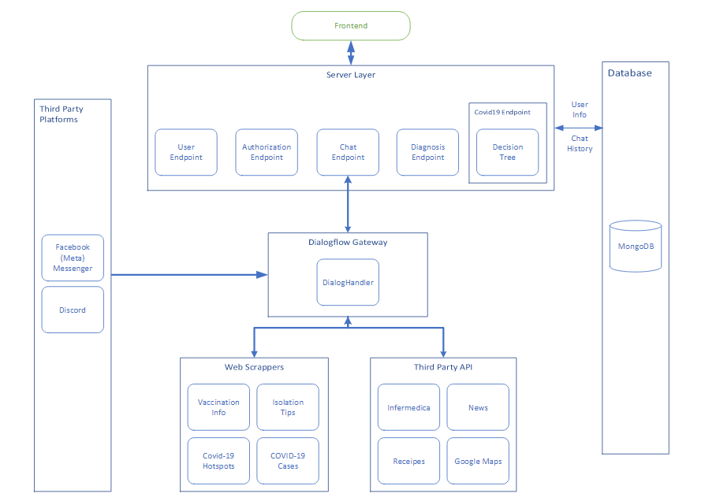
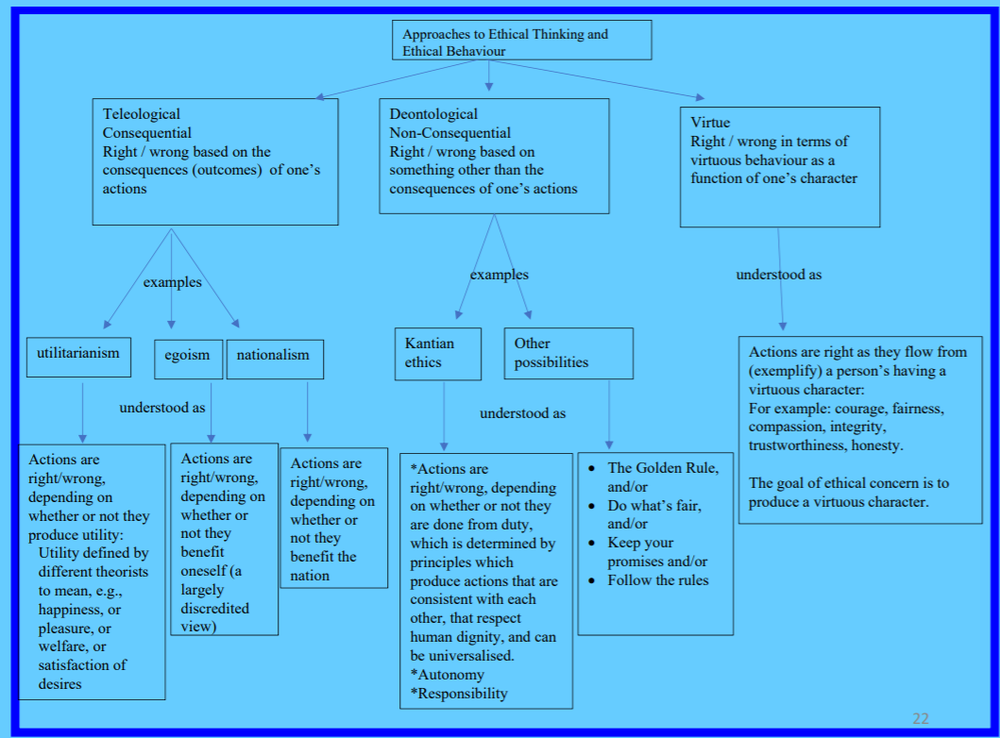

# Overview
This blogs talks about all courses I did in 2021 in UNSW.

## T0
### ECON1101 - Microeconomics

### ECON1203 - Business and Economic Statistics
Foundation of the foundation of stats.
Detailed focus in variances, expectation, regression, etc. (formulae)

## T1
### COMP9517
### COMP3411
### COMP9417
## T2
### COMP3121
### COMP9444
### MATH2801
Foundation/Intro of stats.

## T3
### COMP3900 - Capstone Project
We choose to do the chatbot project (only 3 teams choose it among 100+).
Architecture diagram as below
<figure align="center">

<figcaption align="center">Photo credited: Chi, Our team Scrum Master & teammates</figcaption>
</figure>

Dialogflow intent-based handler passes message from frontend to backend and vice versa, which allows us to unplug the frontend and integrate other platform easier.  
Facebook and Discord integration shares the same output format - plain text. Thou there are built-in API to display them nicer.
Messenger involves webhook but Discord doesn't.  

Side notes:  
The error message for duplicate name in setting up Facebook page is really bad. It said "Invalid page name" rather than duplicate page name. After 5 consecutive tries to realise this, Facebook regards me as a spam user and block me for 1 hr-ish. After some interaction with Facebook API, realise they have done quite some to ensure privacy e.g. can setup some serious privacy protocoal for the Facebook page using some recognised app to define the term of use.

### COMP4920 - Professional Issues and Ethics
We were taught about:
* different ethic theory with a focus on Kant(duty/Deontologist) and Mill(Consequence/Teleologist)
* IP, copy right, etc
* Real-life application of ethics problem and theory
Interestingly have been write for ages until this course. Nice to practise a bit writing skill again.
<figure align="center">

<figcaption align="center">Photo credited: COMP4920 Lecture slides</figcaption>
</figure>

### COMP9418 - Probabilistic Graphical Model
Bayes net, different Markov model(HMM), dynamic Bayes Net. Sampling techniques.
A good balance between theory and coding.

## ENGG2600
### T1
### T2
### T3
